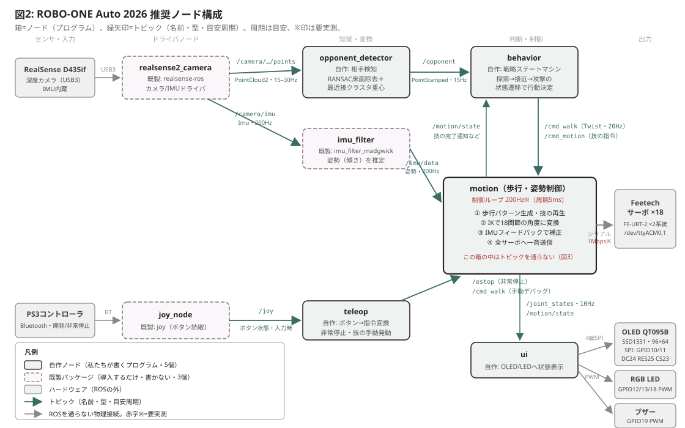
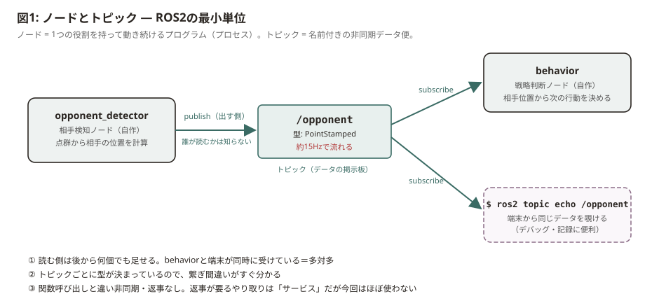
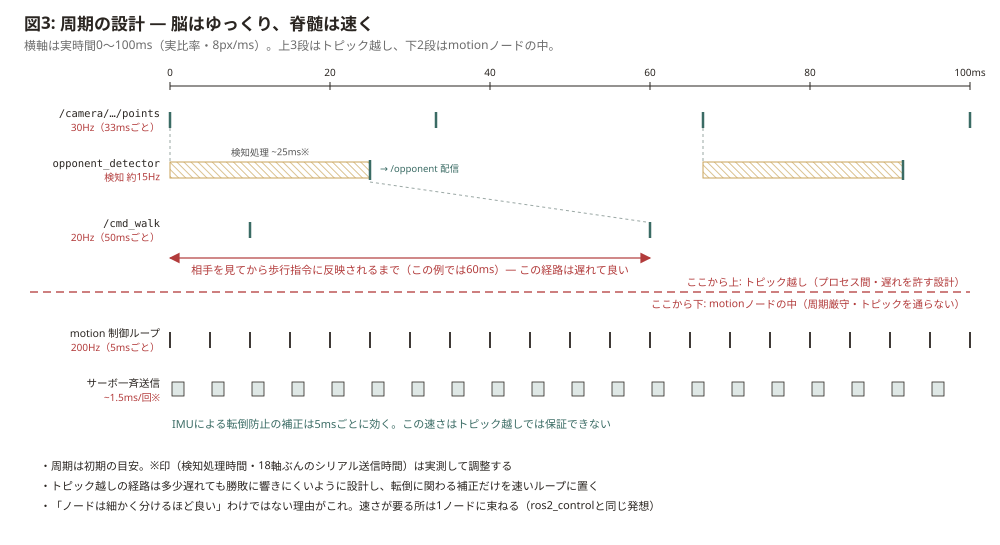

# ROS2 ノード構成の推奨アーキテクチャ

> このファイルは `A-2ndBRAIN/projects/ROBOONE-Auto-2026/ros-architecture.md` の複製。
> 編集は A-2ndBRAIN 側で行い、ここへコピーする（原本を1つに保つため）。

- 対象機体: ROBO-ONE Auto 2026機（Raspberry Pi 5 / ROS2 Jazzy / 18自由度 / RealSense D435if / Feetechサーボ）
- 読者: ノード・トピックをまだ知らない状態のチームメンバー
- 作成: 2026-08-25。周期・処理時間の数字は初期の目安で、※印は要実測

## まず全体像

要点は3つ。

1. **ノードは8個。ただし自作は5個だけ**（opponent_detector・behavior・motion・teleop・ui）。残り3個は既製パッケージをインストールして起動するだけ
2. データは左から右へ「**見る → 考える → 動く**」と流れる。カメラの点群から相手の位置を出し、戦略を決め、歩行・技に落とす
3. **速さが要る200Hzの制御ループはmotionノードの中に閉じ込める**。トピックに流れるのは20Hz以下の指令と、状態の通知だけ（理由は§3）

## 1. ノードとトピック — ROS2の最小単位

- **ノード** = 1つの役割を持って動き続けるプログラム。実体はただのプロセスで、C++でもPythonでも書ける
- **トピック** = ノード間をつなぐ名前付きのデータ便。出す側（publish）は「/opponentに相手位置を流す」とだけ宣言し、誰が読むかは知らない。読む側（subscribe）も誰が書いたか知らない
- この「お互いを知らない」疎結合が効く場面:
  - **単体テスト**: opponent_detectorだけ起動して`ros2 topic echo /opponent`で答え合わせできる。ロボット全体を動かす必要がない
  - **差し替え**: behaviorを作り直しても、/opponentと/cmd_walkの型さえ守れば他のノードは無変更
  - **覗き見**: 試合ログを`ros2 bag record`で丸ごと録って、後から再生して原因調査できる
- 返事が要るやり取り（サービス・アクション）という仕組みもあるが、この構成では使わない。全部トピックで足りる

## 2. 各ノードの責務

| ノード | 自作? | 役割 | 受け取る | 出す |
|---|---|---|---|---|
| realsense2_camera | 既製（realsense-ros） | D435ifから点群・IMUを出す | — | 点群、IMU生値 |
| opponent_detector | **自作** | RANSAC床面除去＋最近接クラスタ重心で相手位置を出す（厚木で検証済みのアルゴリズムをノード化） | 点群 | /opponent |
| imu_filter | 既製（imu_filter_madgwick） | ジャイロ＋加速度から機体の傾きを推定 | IMU生値 | /imu/data |
| behavior | **自作** | 戦略ステートマシン。探索→接近→攻撃の状態遷移で、歩行指令と技指令を出す。/autonomy が true の間だけ出す | /opponent, /ring_edge, /motion/state, /autonomy | /cmd_walk, /cmd_motion, /behavior/state |
| motion | **自作** | 歩行パターン生成・技（キーフレームモーション）再生・IK・IMUバランス補正・サーボ送信。**200Hzループ、この機体の心臓部** | /cmd_walk, /cmd_motion, /imu/data, /estop | /joint_states, /motion/state |
| joy_node | 既製（joy） | PS3コントローラのボタンを読む | — | /joy |
| teleop | **自作** | ボタン→指令変換。非常停止と、開発中の手動操作。自律動作の開始/停止と状態表示 | /joy | /estop, /cmd_walk, /cmd_motion, /autonomy, /ui/* |
| ui | **自作** | OLED(QT095B)・RGB LED・ブザーで状態を提示（電圧・状態・検知の有無など。実体は下の表） | /motion/state, /joint_states | — |

補足:

- ROBO-ONE Autoの本番は自律動作なので、teleopの本番での役割は**非常停止だけ**。開発中はbehaviorを止めてteleopで手動操作すれば、判断層抜きで歩行だけをテストできる
- behaviorとteleopが両方/cmd_walkを出す衝突は、当面「同時に起動しない」運用で回避する。両立が必要になったら`twist_mux`という定番パッケージがある

### 表示まわりの実体（回路リテイクで確定済みの部品）

uiノードが握る2つの出力デバイス。どちらもトピックの先ではなくROSの外の物理接続で、uiノードがプロセス内で直接叩く。

| デバイス | 実体 | Piの資源 |
|---|---|---|
| インジケーター用フルカラーLED | コモンアノード・+5V直結、Nch MOSFET(2N7002K)ローサイド3段。J9 (LED_RGB) | GPIO12/13/18・ハードウェアPWM 各1ch |
| フルカラーOLEDディスプレイ | QT095B（SSD1331・0.95インチ・96×64）。J6 (OLED_socket) にストレート7芯 | SPI0（SCLK=GPIO11・SDIN=GPIO10）＋ CS=GPIO23・D/C=GPIO24・RES=GPIO25 |
| ブザー | 既存回路。Q2(2SC2712)+R5 1k+R7 10k のローサイド駆動 | GPIO19・ハードウェアPWM（PWM0 ch3） |

- 実装の候補: OLEDは`luma.oled`のssd1331ドライバが定番、LEDはRP1のPWMをsysfs（/sys/class/pwm）から。Ubuntu Server 24.04でのPWM有効化手順は要確認
- **OLEDのCSがハードウェアCE0(GPIO8)ではなくGPIO23なので、SPIのチップセレクトをソフトで打つ必要がある**（`luma.oled`なら`gpio_CS`指定、`spidev`なら`no_cs`＋手動GPIO）。CE0は未使用のまま空いている
- ブザーとRGB LEDは同じPWM0ブロックだが別チャンネル（ch3 / ch0-2）なので衝突しない
- PWM 3ch独立はPi 5（RP1）前提。Pi 4のヘッダでは2chしか取れず成立しない
- QT095BのVDDは3.3V駆動。絶対最大定格が4Vなので5V系に繋がない（データシートで確認済み）
- 配線・基板側の根拠は 「回路リテイク」タスク（A-2ndBRAIN/archive/9999-roboone-auto-回路リテイク）

### ピン・ポート配置（全体）

ノードを書く前にここを見る。**ROSのトピックを通らない物理接続はすべてこの表にある。**
根拠は「回路リテイク」タスク（A-2ndBRAIN/archive/9999-roboone-auto-回路リテイク）。

| 接続先 | 種別 | Piの資源 | 扱うノード |
|---|---|---|---|
| Feetechサーボ（バス1） | USB-シリアル（FE-URT-2 / CH343） | `/dev/ttyACM0` | motion |
| Feetechサーボ（バス2） | USB-シリアル（FE-URT-2 / CH343） | `/dev/ttyACM1` | motion |
| RealSense D435if | USB3 | — | realsense2_camera |
| PS3コントローラ | Bluetooth | — | joy_node |
| OLED SCLK | SPI0 | GPIO11 | ui |
| OLED SDIN | SPI0 | GPIO10 | ui |
| OLED CS | GPIO（ソフトCS） | GPIO23 | ui |
| OLED D/C | GPIO | GPIO24 | ui |
| OLED RES | GPIO | GPIO25 | ui |
| RGB LED R/G/B | ハードウェアPWM | GPIO12 / GPIO13 / GPIO18 | ui |
| ブザー | ハードウェアPWM | GPIO19 | ui |
| 冷却ファン | 常時通電（5V直結・制御なし） | — | — |

補足:

- **サーボは2バス構成。** ID採番が系統ごとか通しかは未確認（§6）。`FeetechManager` が複数バスを束ねる前提の実装になっている
- **`/dev/ttyACM*` であって `/dev/ttyUSB*` ではない。** CH343はLinuxでは`cdc_acm`が掴む（2026-08-25 実機確認）。デバイス名は挿し順で入れ替わるため、**確定運用ではudevルールでシリアル番号から固定名を振る**べき（未対応）
- 電源系（J1 Batt_input・J2 SW_socket・J3 SW_motor・主電源の物理遮断）はソフトから触れない。強電を切った状態では全軸に`err=電圧`が立ち一部が無応答になるが、これは故障ではない

## 3. 設計の勘所: 速いループはトピックに乗せない

この構成でいちばん大事な判断がこれ。**「相手を見て次の行動を決める」経路は100ms遅れても勝敗にほぼ響かないが、「傾いたから立て直す」補正は5ms周期で回さないと転ぶ。** だから前者はトピック（プロセス間通信）で緩くつなぎ、後者はmotionノードの中の200Hzループに閉じ込めて、IK→補正→サーボ送信までを関数呼び出しで直結する。

トピックを速いループに使わない理由: ROS2のプロセス間通信（DDS）は便利だが、届くタイミングの保証がない。普段はサブミリ秒でも、たまに数ms遅れる。20Hzの指令なら誤差だが、5ms周期の補正がたまに5ms遅れたら1周期丸ごと落ちる。

これは自己流ではなく、ROS2の標準制御フレームワーク`ros2_control`と同じ設計。あちらもリアルタイム制御ループとハードウェアI/Oを1プロセスに束ね、トピックは境界にしか置かない。今回フル`ros2_control`を採用しないのは、Feetechサーボ用のハードウェアインターフェースをどのみち自作する必要があり、18軸のモーション再生＋歩行が主体のROBO-ONE機では自前ループの方が見通しが良いため。将来載せ替えたくなっても、この境界設計ならmotionノードの中身を移すだけで済む。

関連タスク: 「RTOS導入」タスク（A-2ndBRAIN/tasks/9999-RTOS導入）。PREEMPT_RTカーネルで良くなるのは、まさにこのmotionループの周期精度。この構成ならRTOS化の効果がmotionノード1個に集約されるので、導入判断も「motionループの周期ジッタを実測して、素のカーネルで足りるか見る」に落ちる。

## 4. トピック一覧（チーム内の約束事）

ここが実質的なチーム内API。ノードの中身は各自が好きに書き直してよいが、この表を変えるときは全員に共有する。

| トピック | 型 | 出す→受ける | 目安周期 |
|---|---|---|---|
| /camera/…/points | sensor_msgs/PointCloud2 | realsense2_camera → opponent_detector | 15–30Hz |
| /camera/imu | sensor_msgs/Imu | realsense2_camera → imu_filter | 200Hz |
| /imu/data | sensor_msgs/Imu（姿勢入り） | imu_filter → motion | 200Hz |
| /opponent | roboone_interfaces/Opponent（位置・上端高さ・速度） | opponent_detector → behavior | 約15Hz※ |
| /cmd_walk | geometry_msgs/Twist | behavior・teleop → motion | 20Hz |
| /cmd_motion | std_msgs/String（技名） | behavior・teleop → motion | イベント時 |
| /estop | std_msgs/Bool | teleop → motion | イベント時 |
| /motion/state | std_msgs/String | motion → behavior・ui | 状態変化時 |
| /joint_states | sensor_msgs/JointState | motion → ui・記録 | 10Hz |
| /joy | sensor_msgs/Joy | joy_node → teleop | 入力時 |
| /autonomy | std_msgs/Bool（latched） | teleop → behavior | イベント時。true の間だけ behavior が /cmd_walk・/cmd_motion を出す（2026-08-28 追加） |
| /ring_edge | std_msgs/Float32MultiArray | opponent_detector → behavior | 約15Hz。方位別のリング縁までの距離（2026-08-28 追加） |
| /ui/oled/text, /ui/led/pattern, /ui/buzzer | roboone_interfaces/OledText, std_msgs/String ×2（latched） | teleop → ui | 状態変化時（2026-08-28 追加） |
| /motion/joint_commands, /motion/servo_states, /motion/diagnostics | sensor_msgs/JointState ×2, diagnostic_msgs/DiagnosticArray | motion → 記録 | 10Hz。指令と実測の差を追うため（2026-08-28 追加） |
| /odom | nav_msgs/Odometry | motion → behavior | **未実装**。behavior は無くても動く（自分の指令から推定） |

補足:

- トピックの完全名はlaunch設定で決まる。realsense-rosの現行デフォルトは`/camera/camera/depth/color/points`のような二重名前空間になる
- D435ifのIMUはデフォルトだとgyroとaccelが別トピックで出る。imu_filter_madgwickに食わせるには、realsense-ros側で`unite_imu_method`を設定して1本の/imuに統合する
- QoS（通信の品質設定）は、点群とIMUが「最新だけ届けばいい」のでSensorData（Best Effort）、指令系は「取りこぼし禁止」なのでReliableにする。ここだけ守れば当面は深入り不要
- /cmd_motionは最初はStringで十分。技にパラメータが要るようになったら独自msg型に昇格させる

## 5. 作る順番

依存の少ない下流（サーボ側）から作る。各段階に「ロボット全体なしで確認できるゴール」を置く。

0. **ROS抜きでサーボ単体確認**: ノードはまだ作らない。まずFeetech公式デバッグソフト（FD）で1個ずつID設定（1〜18）し、次にPi上の素のPythonスクリプト（`pip install feetech-servo-sdk`）でping→位置読み→1軸動作→SyncWrite一斉送信。この過程で書いた通信コードをROS非依存のドライバクラス（`feetech_bus.py`）に育て、motionノードは後でそれをimportする。§6のシリアル帯域実測もこのスクリプトで済ませる。スクリプトは `scripts/feetech_check.py`（読むだけ・安全）と `scripts/feetech_benchmark.py`（トルクOFFで帯域実測）を用意済み、scpでPiへ送って使う
1. **motionの骨組み＋サーボ送信**: 18軸に初期姿勢を送って立たせる。確認は`ros2 topic pub /cmd_motion std_msgs/String "data: home"`を端末から手で叩く
2. **teleop経路**: PS3コントローラ→/joy→/estopで脱力できるところまで。**非常停止は歩行開発を始める前に必ず作る**
3. **歩行**: /cmd_walkを受けて歩く。ここが最大の山。まず前進だけ、IMU補正は静歩行が安定してから足す
4. **opponent_detector**: 厚木で検証済みのRANSAC＋クラスタ重心をノードに移植。ロボットと独立に、カメラだけ繋いで`ros2 topic echo /opponent`で確認できる（3と並行作業可）
5. **behavior**: 最後に配線。最初は「相手の方向へ歩く」だけの1状態から始めて、試合ルールに合わせて状態を足す
6. **ui**: 余裕が出てから。それまでLEDは motion 内で直接光らせても困らない

開発のコツ: PC側にもROS2環境があれば、有線1対1リンク（192.168.50.x）越しにPCの`rviz2`で点群や/opponentを可視化できる。ROS2は同一LANのノードを自動発見するので設定はほぼ不要、混線防止に`ROS_DOMAIN_ID`だけ揃える。

## 6. まだ決めていないこと（要実測・要判断）

- **制御ループ周波数**: 200Hzは仮置き。律速は18軸ぶんのシリアル送受信時間。FT-URT経由のsync write一斉送信＋フィードバック読み取りが実測何Hzで回るかを最初に測る。100Hzに落としても二足歩行は成立する
- **検知処理時間**: RANSAC＋クラスタリングがPi 5上で1フレーム何msかかるか未実測。図3の25msは仮の数字
- **imu_filterの置き場所**: 別ノード案で始めるが、/imu/data経由のジッタが補正に効くようなら、フィルタをmotionノード内に取り込む選択肢を残す
- **点群の解像度**: RealSense検証タスクの結論より、848x480@60は不安定（40%で異常）。デフォルト構成（848x480@30）か640x480@30から始める（詳細: A-2ndBRAIN/archive/0701-realsenseラズパイ実装/d435if_bandwidth_benchmark.md）
- **ros2_controlへの載せ替え**: 当面しない。motionループのジッタが問題になった時、RTOS導入と合わせて再検討
